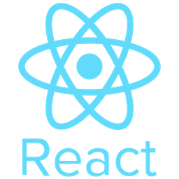
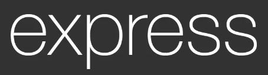
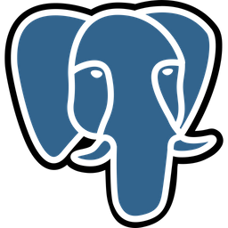

<h1 align="center">Hi, there!   I'm Eric</h1>

  &nbsp;
  &nbsp;
  &nbsp;
  &nbsp;
  &nbsp;

<h3 align="center"> A Junior Full Stack Web Developer   with 10+ years of experience as a Sales Executive. 

Looking forward to joining a team,   while I keep learning and mastering my coding skills.
</h3>

## 👨‍💻 Frontend Stack

    
    &nbsp;
    
    &nbsp;
    
    &nbsp;
    
    &nbsp;
    
    &nbsp;
    
    &nbsp;
    
    &nbsp;
    

 

## 🛠️ Backend Stack

    
    &nbsp;
    
    &nbsp;
    
    &nbsp;
    
    &nbsp;

 

## 📊 Github Stats

<b>🔥 Streak Stats</b>

  
<b>💻 Profile Stats</b>

   
  

    
 
  &nbsp;
	  
   
  <b>Note:</b> Top languages is only a metric of the languages my public code consists of and doesn't reflect experience or skill level.
  

<!--
**elehmann92/elehmann92** is a ✨ _special_ ✨ repository because its `README.md` (this file) appears on your GitHub profile.

Here are some ideas to get you started:

- 🔭 I’m currently working on ...
- 🌱 I’m currently learning ...
- 👯 I’m looking to collaborate on ...
- 🤔 I’m looking for help with ...
- 💬 Ask me about ...
- 📫 How to reach me: ...
- 😄 Pronouns: ...
- ⚡ Fun fact: ...
-->
